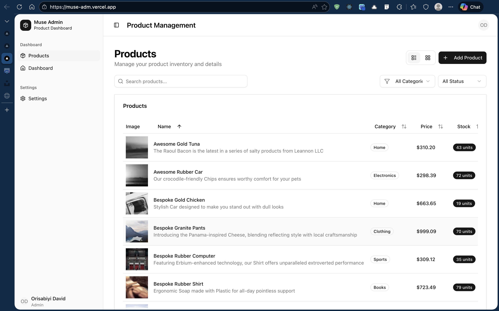
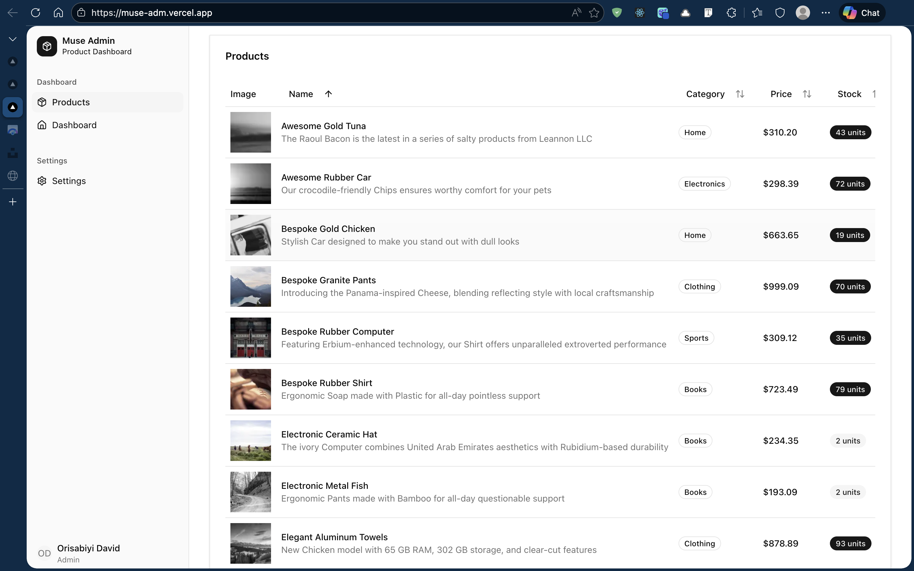
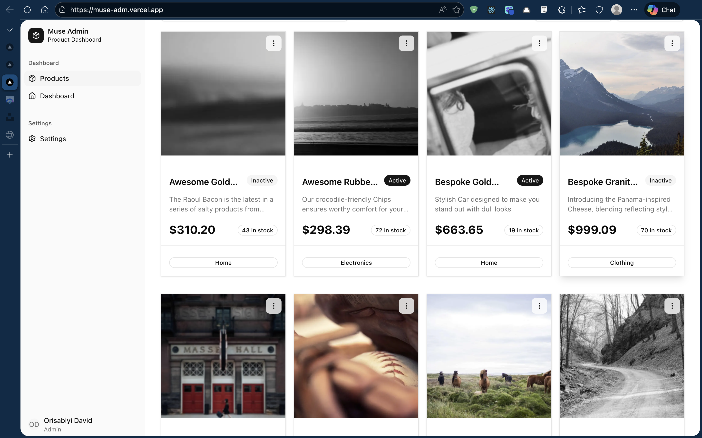
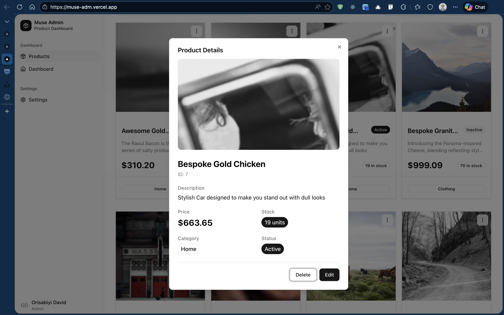
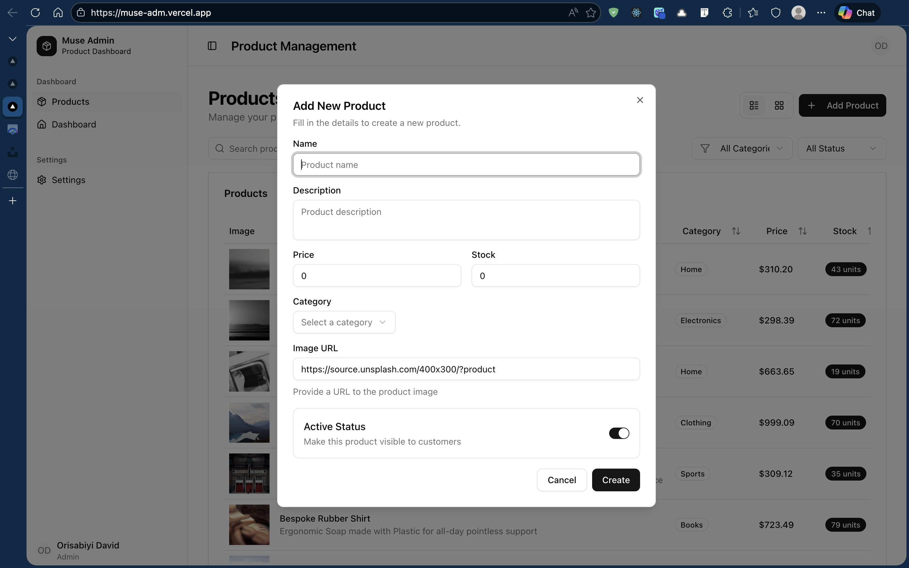
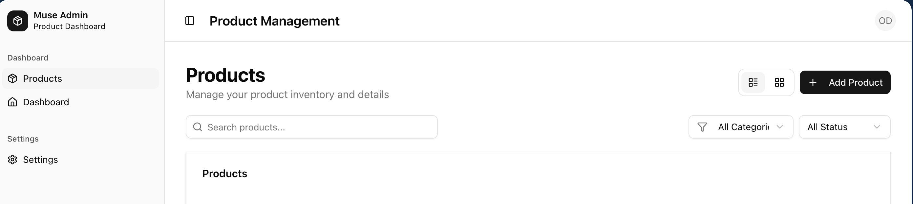
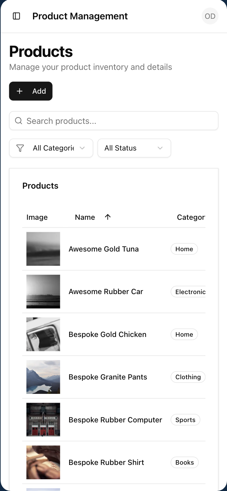

# 🎨 Muse Admin - Product Management Dashboard

A modern, responsive product management dashboard built with Next.js, TypeScript, and shadcn/ui. Features a complete CRUD interface with advanced filtering, sorting, and real-time search capabilities.



## ✨ Features

- 📊 **Dual View Modes** - Switch between table and grid layouts
- 🔍 **Advanced Search** - Real-time search across product names and descriptions
- 🎯 **Smart Filtering** - Filter by category and status with live updates
- ⬆️⬇️ **Column Sorting** - Sort by name, category, price, stock, and status
- ✏️ **Full CRUD Operations** - Create, read, update, and delete products
- 📱 **Fully Responsive** - Optimized for mobile, tablet, and desktop
- 🎨 **Modern UI** - Beautiful interface with shadcn/ui components
- 📄 **Pagination** - Efficient data display with 10 items per page
- ✅ **Form Validation** - Client-side validation with Zod
- 🔔 **Toast Notifications** - Real-time feedback for user actions
- 👁️ **Product Details View** - Detailed modal view for each product

## 🚀 Tech Stack

### Core Framework

- **Next.js 14** - React framework with App Router
- **TypeScript** - Type-safe development
- **React 18** - UI library

### UI & Styling

- **shadcn/ui** - Accessible, customizable component library
- **Tailwind CSS** - Utility-first CSS framework
- **Lucide Icons** - Beautiful icon set

### State Management & Data Fetching

- **React Query (@tanstack/react-query)** - Server state management
- **Axios** - HTTP client for API requests

### Form Handling & Validation

- **React Hook Form** - Performant form library
- **Zod** - TypeScript-first schema validation

### Additional Libraries

- **Sonner** - Toast notifications
- **Next/Image** - Optimized image loading

## 📸 Screenshots

### Dashboard - Table View



### Dashboard - Grid View



### Product Details Modal



### Create/Edit Product



### Search & Filter



### Mobile Responsive



## 🛠️ Installation & Setup

### Prerequisites

- Node.js 18.x or higher
- npm or yarn package manager

### Step 1: Clone the Repository

```bash
git clone https://github.com/YOUR_USERNAME/muse-admin.git
cd muse-admin
```

### Step 2: Install Dependencies

```bash
pnpm install
or
npm install
```

### Step 3: Environment Variables

Create a `.env.local` file in the root directory:

```bash
NEXT_PUBLIC_API_URL=https://YOUR-PROJECT-ID.mockapi.io/api/v1
```

Replace `YOUR-PROJECT-ID` with your actual mockapi.io project ID.

### Step 4: Run Development Server

```bash
pnpm run dev
or
npm run dev
```

Open [http://localhost:3000](http://localhost:3000) in your browser.

### Step 5: Build for Production

```bash
pnpm run build
pnpm start
# or
npm run build
npm start
```

## 📁 Project Structure

```
muse-admin/
├── app/
│   ├── layout.tsx              # Root layout with providers
│   ├── page.tsx                # Main products page
│   └── globals.css             # Global styles
│
├── components/
│   ├── ui/                     # shadcn/ui components
│   ├── dashboard/
│   │   └── dashboard-layout.tsx    # Sidebar & header layout
│   ├── products/
│   │   ├── product-table.tsx       # Table view with sorting
│   │   ├── product-card.tsx        # Grid card component
│   │   ├── product-form.tsx        # Create/edit form modal
│   │   ├── product-details-dialog.tsx  # View details modal
│   │   ├── delete-dialog.tsx       # Delete confirmation
│   │   └── search-filter.tsx       # Search & filter bar
│   └── providers.tsx           # React Query provider
│
├── hooks/
│   └── useProducts.ts          # React Query hooks for CRUD
│
├── lib/
│   ├── api.ts                  # API service layer
│   ├── validations.ts          # Zod schemas
│   └── utils.ts                # Utility functions
│
├── types/
│   └── product.ts              # TypeScript interfaces
│
├── public/
│   └── screenshots/            # Application screenshots
│
├── .env.local                  # Environment variables (gitignored)
├── next.config.js              # Next.js configuration
├── tailwind.config.ts          # Tailwind configuration
├── tsconfig.json               # TypeScript configuration
└── package.json                # Dependencies and scripts
```

## 🎯 Technical Decisions

### Architecture Choices

#### 1. **Next.js 14 with App Router**

**Why:** Chose Next.js App Router for its cutting-edge features including React Server Components, improved routing system, and built-in performance optimizations.

**Benefits:**

- Automatic code splitting reduces initial bundle size
- Server Components reduce client-side JavaScript
- Improved SEO with server-side rendering
- Built-in image optimization and font loading
- Better developer experience with improved error handling

**Trade-offs:** Slight learning curve with new paradigms (Server vs Client Components), but the long-term benefits in performance and maintainability far outweigh the initial investment.

---

#### 2. **React Query for State Management**

**Why:** Selected React Query over Redux for superior server state management in API-heavy applications.

**Benefits:**

- **Automatic Caching:** Data cached automatically with configurable stale times (60s in this app)
- **Background Refetching:** Automatically refetches data when tabs regain focus
- **Built-in States:** Loading, error, and success states handled automatically
- **90% Less Boilerplate:** No actions, reducers, or middleware required
- **Optimistic Updates:** UI updates immediately while API calls process in background
- **Query Invalidation:** Automatic cache invalidation after mutations

**Alternative Considered:** Redux Toolkit - rejected because it requires significant boilerplate for simple CRUD operations. React Query is purpose-built for server state and handles it more elegantly.

**Configuration:**

```typescript
// lib/query-client.ts
staleTime: 60 * 1000; // Data fresh for 60 seconds
refetchOnWindowFocus: false; // Don't refetch on tab switch
```

**Rationale:** Product data doesn't change frequently, so aggressive refetching would waste resources. 60-second stale time balances freshness with performance.

---

#### 3. **shadcn/ui Component Library**

**Why:** Chose shadcn/ui for its unique copy-paste approach that provides accessible, customizable components without traditional UI library bloat.

**Benefits:**

- **Zero Bundle Impact:** Components copied into your project, not imported from node_modules
- **Full Control:** Own the component code - modify anything without fighting library constraints
- **Accessibility First:** Built on Radix UI primitives (WCAG compliant out of the box)
- **Tailwind Integration:** Seamless styling with utility classes
- **TypeScript Native:** Fully typed components with excellent IntelliSense

**Alternative Considered:** Material-UI - rejected due to:

- Large bundle size (~300KB minified)
- Difficult customization (theme overrides complex)
- Less flexibility in component structure
- More opinionated design system

**Components Used:**

- Table, Card, Dialog, Form, Select, Button, Badge, Pagination
- Dropdown Menu, Sidebar, Skeleton, Toast, Input

---

#### 4. **Client-Side Filtering & Sorting**

**Why:** Implemented client-side filtering/sorting for instant user feedback and reduced API load.

**Implementation:**

```typescript
// Fetch all products once
const { data: products } = useGetAllProducts(1, 100);

// Filter and sort in useMemo
const filteredAndSortedProducts = useMemo(() => {
  return products
    .filter(/* search, category, status */)
    .sort(/* by selected field and order */);
}, [products, filters, sortField, sortOrder]);
```

**Benefits:**

- **Instant Feedback:** No API delay when filtering/sorting
- **Reduced API Calls:** Fetch data once, manipulate locally
- **Better UX:** Smooth, responsive interactions
- **Simpler Backend:** No need for complex query parameters

**Trade-offs:**

- Works efficiently up to ~1,000 products
- Initial load fetches all data (larger payload)
- Not suitable for massive datasets

**Future Enhancement:** For production apps with 10,000+ products, migrate to server-side pagination with query parameters like `?page=1&limit=10&sort=price&order=asc&category=Electronics`.

---

#### 5. **React Hook Form + Zod Validation**

**Why:** Chose this combination for type-safe form validation with excellent developer experience.

**Benefits:**

- **Type Safety:** Zod schemas automatically infer TypeScript types
- **Performance:** Minimal re-renders (uncontrolled inputs with ref-based validation)
- **Easy Integration:** First-class support for shadcn form components
- **Clear Error Messages:** User-friendly validation feedback
- **Schema Reusability:** Same Zod schema for client and server validation

**Example:**

```typescript
// Define schema once
const productSchema = z.object({
  name: z.string().min(3),
  price: z.number().positive(),
  stock: z.number().int().min(0),
});

// Automatic type inference
type ProductFormValues = z.infer<typeof productSchema>;
```

**Alternative Considered:** Formik - rejected due to:

- More re-renders (controlled inputs)
- Larger bundle size
- Less type-safe validation options
- Slower performance with large forms

---

#### 6. **TypeScript Throughout**

**Why:** Enforced strict TypeScript across the entire codebase for type safety and improved maintainability.

**Benefits:**

- **Compile-Time Error Catching:** Bugs caught before runtime
- **Better IDE Support:** Autocomplete, inline documentation, refactoring tools
- **Self-Documenting Code:** Types serve as inline documentation
- **Refactoring Confidence:** TypeScript ensures changes don't break contracts
- **Team Scalability:** Easier onboarding with clear interfaces

**Type Strategy:**

```typescript
// API Response Types
interface Product {
  id: string;
  price: string; // API returns string
  // ...
}

// Form Types
interface ProductFormData {
  price: number; // Form uses number
  // ...
}

// Conversion handled in API layer
```

**Trade-off:** Slightly slower initial development, but prevents runtime errors and improves long-term velocity.

---

### Design Patterns

#### Component Architecture

**Separation of Concerns:**

- **Presentational Components:** Pure UI components (ProductCard, ProductTable)
- **Container Logic:** Business logic in custom hooks (useProducts)
- **API Layer:** Centralized in `lib/api.ts`

**Compound Components:**

- Modal dialogs composed of smaller parts (DialogHeader, DialogContent, DialogFooter)
- Easier to maintain and test individual pieces

**Prop Drilling Minimization:**

- React Query hooks accessed directly in components
- Eliminates need to pass data through multiple component levels

---

#### State Management Strategy

**Server State (React Query):**

- Product data from API
- Mutations (create, update, delete)
- Automatic caching and invalidation

**UI State (useState):**

- Modal open/closed states
- Current page number
- Selected filters and sort options

**Form State (React Hook Form):**

- Form values
- Validation errors
- Submission status

**No Global State Needed:** Application doesn't require Redux or Context API because:

- Server state managed by React Query
- UI state is local to components
- No deeply nested prop drilling

---

#### API Layer Design

**Centralized API Service:**

```typescript
// lib/api.ts
export const productApi = {
  getAll: (page, limit, search) => axios.get("/products"),
  create: (product) => axios.post("/products", product),
  update: (id, product) => axios.put(`/products/${id}`, product),
  delete: (id) => axios.delete(`/products/${id}`),
};
```

**Type Conversion:**

```typescript
// Handle mockapi.io's string prices
create: async (product: ProductFormData) => {
  const payload = {
    ...product,
    price: product.price.toString(), // number → string
  };
  return api.post("/products", payload);
};
```

**Error Handling:**

```typescript
// Consistent error handling with toast notifications
onError: (error: Error) => {
  toast.error(error.message || "Operation failed");
};
```

---

### Performance Optimizations

#### 1. **useMemo for Filtering/Sorting**

Prevents expensive filter/sort operations on every render:

```typescript
const filteredProducts = useMemo(() => {
  return products.filter(...).sort(...);
}, [products, filters, sortConfig]);
```

#### 2. **React Query Caching**

60-second stale time reduces unnecessary API calls:

```typescript
staleTime: 60 * 1000;
```

#### 3. **Next/Image Optimization**

Automatic image optimization with lazy loading:

```typescript
<Image src={url} fill className="object-cover" sizes="..." />
```

#### 4. **Pagination**

Limit rendered items to 10 per page for better performance with large datasets.

#### 5. **Code Splitting**

Next.js automatically splits code per route, reducing initial bundle size.

---

### Accessibility Features

**Keyboard Navigation:**

- All interactive elements keyboard accessible
- Tab order follows logical flow
- Escape key closes modals

**ARIA Labels:**

```typescript
<Button aria-label="Delete product">
  <Trash2 />
</Button>
```

**Focus Management:**

- Modals trap focus appropriately
- Focus returns to trigger element when closed

**Color Contrast:**

- WCAG AA compliant color scheme
- Status badges use both color and text

**Responsive Design:**

- Mobile-first approach
- Touch-friendly target sizes (min 44×44px)
- Responsive font sizes

---

### API Integration Strategy

**mockapi.io Configuration:**

- 100 products generated with Faker.js
- Categories: Electronics, Clothing, Books, Home, Sports
- Price range: $10-$1000
- Stock range: 0-100 units

**Why mockapi.io:**

- Quick setup for proof-of-concept
- RESTful endpoints match real-world APIs
- Supports all CRUD operations
- No authentication needed for demo

**Production Considerations:**

- Replace with actual backend API
- Add authentication/authorization
- Implement server-side pagination
- Add proper error handling for network failures

---

## 📦 Available Scripts

```bash
npm run dev          # Start development server on localhost:3000
npm run build        # Build optimized production bundle
npm start            # Start production server
npm run lint         # Run ESLint for code quality checks
```

## 🔮 Future Enhancements

### High Priority

- [ ] **Server-side pagination** - For datasets with 10,000+ products
- [ ] **Bulk operations** - Multi-select with bulk edit/delete
- [ ] **Export functionality** - Export products to CSV/Excel
- [ ] **Image upload** - Replace URLs with actual file uploads

### Medium Priority

- [ ] **Product categories management** - CRUD for categories
- [ ] **Advanced filters** - Price range slider, date ranges
- [ ] **Product variants** - Size, color options
- [ ] **Inventory alerts** - Low stock notifications

### Nice to Have

- [ ] **Dark mode** - Theme toggle with system preference detection
- [ ] **Analytics dashboard** - Sales trends, popular products
- [ ] **Print functionality** - Print-friendly product reports
- [ ] **Internationalization** - Multi-language support

## 🐛 Known Issues

None at this time. If you encounter any issues, please [open an issue](https://github.com/YOUR_USERNAME/muse-admin/issues) on GitHub.

## 🤝 Contributing

Contributions are welcome! Please follow these steps:

1. Fork the repository
2. Create a feature branch (`git checkout -b feature/amazing-feature`)
3. Commit your changes (`git commit -m 'Add amazing feature'`)
4. Push to the branch (`git push origin feature/amazing-feature`)
5. Open a Pull Request

## 📄 License

This project is licensed under the MIT License - see the [LICENSE](LICENSE) file for details.

## 👤 Author

**Your Name**

- GitHub: [@YOUR_USERNAME](https://github.com/YOUR_USERNAME)
- LinkedIn: [Your LinkedIn](https://linkedin.com/in/YOUR_PROFILE)
- Portfolio: [yourportfolio.com](https://yourportfolio.com)

## 🙏 Acknowledgments

- [Next.js](https://nextjs.org/) - The React framework for production
- [shadcn/ui](https://ui.shadcn.com/) - Beautifully designed components
- [React Query](https://tanstack.com/query) - Powerful data synchronization
- [Tailwind CSS](https://tailwindcss.com/) - Utility-first CSS framework
- [mockapi.io](https://mockapi.io/) - Free mock API service
- [Radix UI](https://www.radix-ui.com/) - Unstyled, accessible components
- [Lucide](https://lucide.dev/) - Beautiful & consistent icon set

---

**Built with ❤️ using Next.js and TypeScript**
